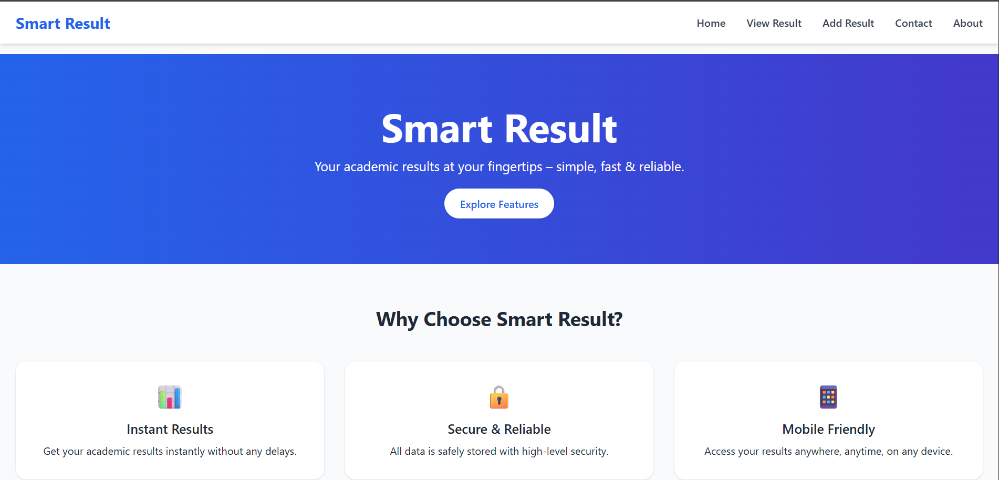
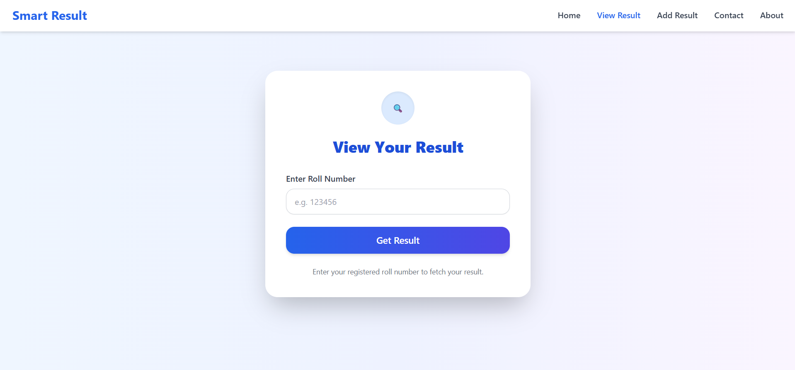
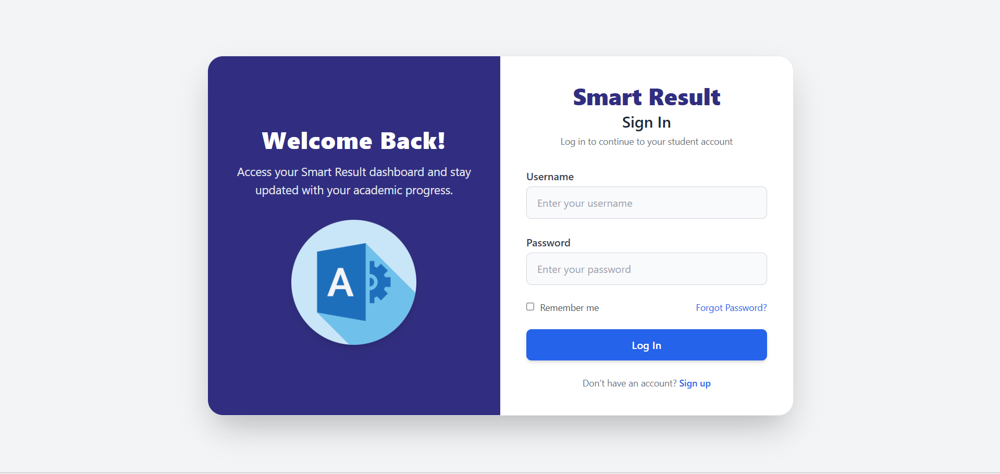
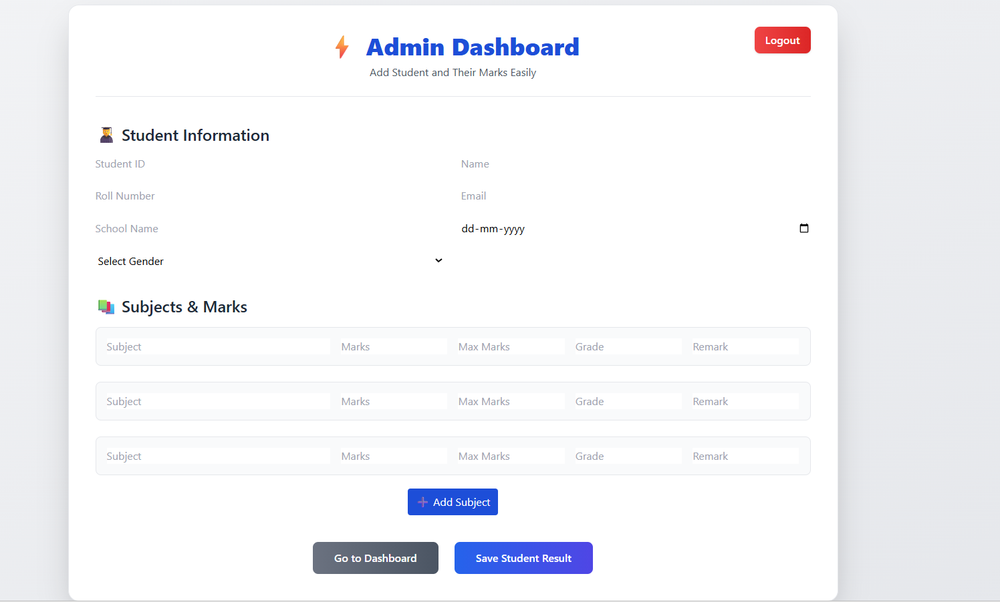
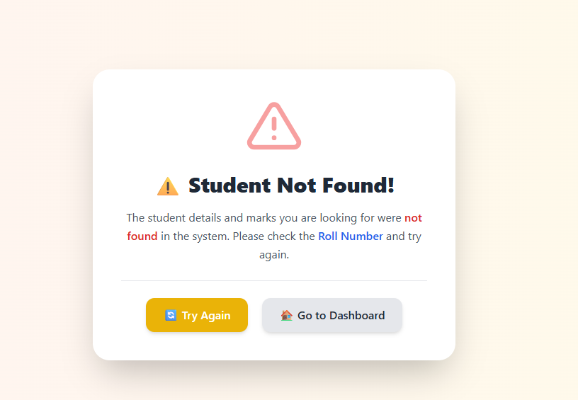
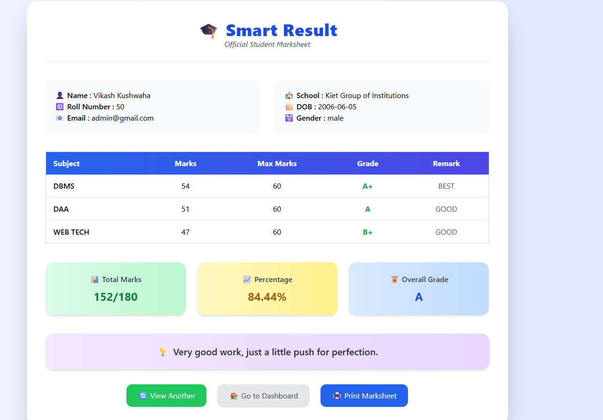

# Smart-Result-Dashboard
Smart Result is a Spring Boot project designed for intelligent result management, display, or analytics in educational or data-driven applications
## Project Screenshots

Below are screenshots of key features in the Smart Result Dashboard:

### Dashboard



### View Result



### Login



### Add Result



### Invalid Roll No



### Result Views




Smart Result Dashboard is a web application designed to provide institutions, teachers, and students with an interactive, efficient way to publish, display, and analyze exam results. The project uses Thymeleaf templates for the UI and is powered by a robust Spring Boot backend.

## Features

- **Result Publishing:** Easy upload and management of student results.
- **Interactive Dashboard:** Visualization of performance data using charts and tables.
- **Analytics & Insights:** Student, class, and subject-wise breakdowns.
- **Secure Student Portal:** Students can log in to view and download their results.
- **Admin & Teacher Portals:** Manage data, users, and access analytics.
- **Export Options:** Download results in PDF/Excel formats (if available).

## Technologies Used

- **Frontend:** HTML, CSS, [Thymeleaf](https://www.thymeleaf.org/)
- **Backend:** [Spring Boot](https://spring.io/projects/spring-boot)
- **Database:** (Please specify your database, e.g., MySQL, PostgreSQL)
- **Visualization:** (Specify if using chart libraries, e.g., Chart.js via Thymeleaf)
- **Authentication:** Spring Security (recommended; update if otherwise)

## Getting Started

### Prerequisites

- Java 17+
- Maven 
- Database (e.g., MySQL/PostgreSQL), with connection credentials

### Installation

1. **Clone the repository**
    ```bash
    git clone https://github.com/its-vikash-Kushwaha/Smart-Result-Dashboard.git
    cd Smart-Result-Dashboard
    ```

2. **Configure Database**
    - Edit `src/main/resources/application.properties`:
      ```properties
      spring.datasource.url=jdbc:mysql://localhost:3306/smart_result_db
      spring.datasource.username=your_username
      spring.datasource.password=your_password
      spring.jpa.hibernate.ddl-auto=update
      ```
    - Create the database with your chosen name, e.g., `smart_result_db`.

3. **Build and Run the Application**
    ```bash
    # Using Maven
    ./mvnw spring-boot:run
    ```

4. **Access the Dashboard**
    ```
    http://localhost:8080/
    ```

## Usage

- **Admin:** Upload results, manage users, and access analytics.
- **Student:** Log in to view/download individual results.

## Project Structure

```
src/
  main/
    java/
      com/
        example/
          dashboard/      # Spring Boot Java sources
    resources/
      templates/          # Thymeleaf HTML files
      static/             # CSS, JS, images
      application.properties
smart-result/
  images/
    img.png               # Dashboard screenshot
    view-result.png       # View result screenshot
    login.png             # Login page screenshot
    add-result.png        # Add result screenshot
    invalid-roll-no.png   # Invalid roll number screenshot
```

## Contributing

Contributions are welcome!
1. Fork the repo
2. Create a feature branch (`git checkout -b feature-name`)
3. Commit your changes (`git commit -am 'Add new feature'`)
4. Push to your branch (`git push origin feature-name`)
5. Open a Pull Request

## License

MIT License. See [LICENSE](LICENSE).

## Contact

Questions/support: [Vikash Kushwaha](mailto:vikashkus7309@gmail.com)

LinkedIn: [linkedin.com/in/vikash-kushwaha](https://www.linkedin.com/in/vikash-kushwaha-a97775250/)
---

*Update the image file names/paths and other details to match your actual project structure and resources!*
